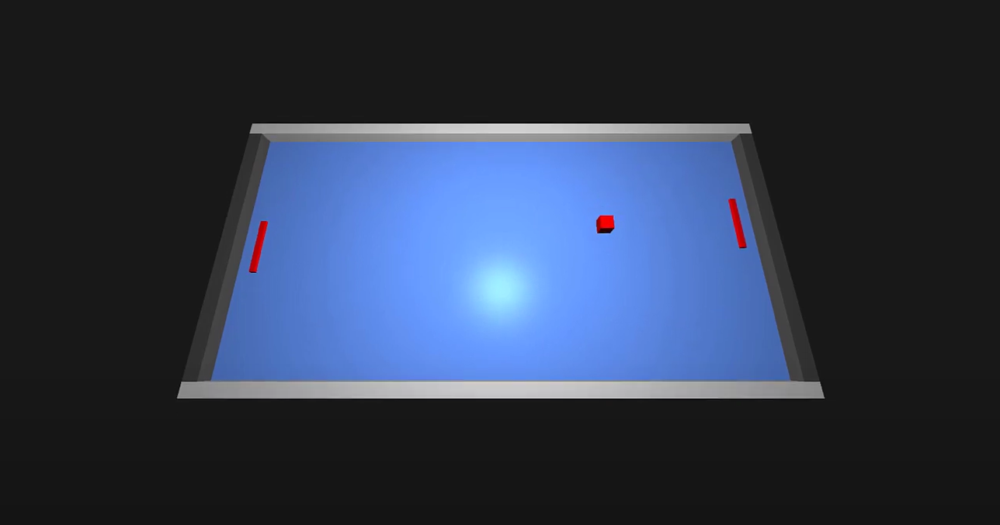

> **Note**
> GLSL Engine is able to run sequence of GLSL shaders, allows communication between them and provides access to peripherals like keyboard and mouse directly from shader environment.

This experimental engine was created as part of my [bachelor thesis](https://dspace.vutbr.cz/handle/11012/207311). The engine itself runs on CPU, but the application itself is being executed entirely on GPU. Applications are represented as set of OpenGL programs (GLSL shaders) defined in one single source file. The engine covers all the basic OpenGL functionality and provides fast way to prototype OpenGL shaders. Thanks to the engine user can also detect keyboard and mouse state (key presses, position) directly from GLSL shaders.

To demonstrate functionality of the engine, multiple simple demo applications were created (see [examples](https://github.com/bugulo/glsl-engine/examples)), for example game Pong:


## Build
```
cmake . && make
```

## Run
```
cd bin
./engine <shader-file-path>
```